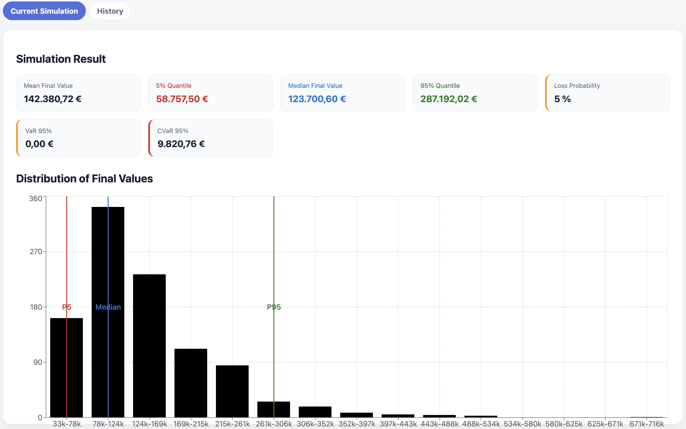
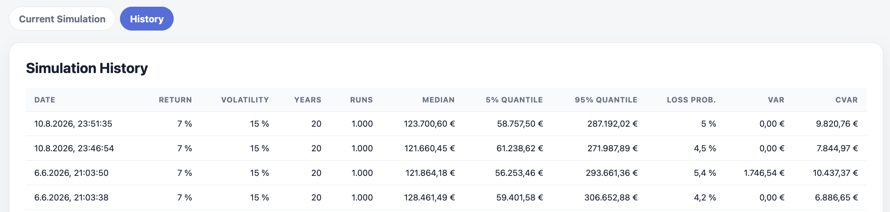

# Risk Analytics Dashboard

A full-stack application for Monte Carlo based portfolio risk analysis.

## Screenshots

### Monte Carlo Risk Analysis

The dashboard visualizes the distribution of simulated portfolio outcomes,
including the median, downside and upside quantiles, and risk metrics such
as loss probability, Value at Risk (VaR), and Conditional Value at Risk (CVaR).

### Simulation History

Previous simulation runs are persisted in PostgreSQL and can be reviewed
through the history view.

## Goal

The goal of this project is to combine:

* quantitative risk modelling
* software engineering
* database development
* reporting and analytics

into a single application.

Users can define investment scenarios and estimate the distribution of future portfolio values using Monte Carlo simulation.

## Technology Stack

### Backend

* Java 25
* Spring Boot
* Spring Data JPA
* Flyway
* PostgreSQL

### Frontend

* React
* TypeScript

### Infrastructure

* Docker
* Docker Compose

## Current Features

### Simulation

The backend currently supports:

* Initial capital
* Monthly contribution
* Expected annual return
* Annual volatility
* Investment horizon
* Number of simulation runs/paths

### Monte Carlo Model

The simulation uses a geometric Brownian motion with monthly time steps.

For each simulation path:

1. A standard normal random variable is generated.
2. A growth factor is computed.
3. The portfolio value is updated.
4. Monthly contributions are added.

### Statistical Summary

After all simulation runs have been completed, the following statistics are calculated:

* Mean final value
* Median final value
* 5% quantile
* 95% quantile
* Loss probability

The results are persisted in PostgreSQL.

## Planned Features

* React frontend
* Interactive parameter form
* Visualization of simulation results
* Histogram of final portfolio values
* Simulation history
* Reporting dashboard

## Disclaimer

This project is intended as a software engineering and analytics demonstration.

It is not intended to provide financial advice.
